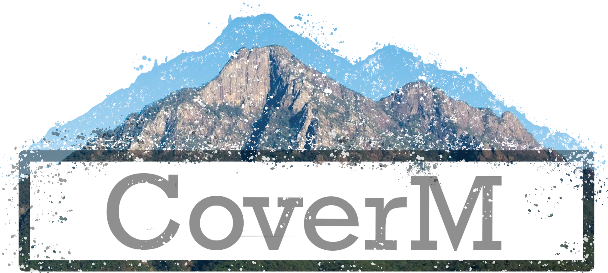

- [CoverM](#coverm)
	- [Installation](#installation)
		- [Install through the bioconda package](#install-through-the-bioconda-package)
		- [Pre-compiled binary](#pre-compiled-binary)
		- [Compiling from source](#compiling-from-source)
		- [Development version](#development-version)
		- [Dependencies](#dependencies)
		- [Shell completion](#shell-completion)
	- [Usage](#usage)
	- [Calculation methods](#calculation-methods)
	- [License](#license)

# CoverM

[](https://anaconda.org/bioconda/coverm)

CoverM aims to be a configurable, easy to use and fast DNA read coverage and
relative abundance calculator focused on metagenomics applications.

CoverM calculates coverage of genomes/MAGs `coverm genome` ([help](https://wwood.github.io/CoverM/coverm-genome.html)) or individual
contigs `coverm contig` ([help](https://wwood.github.io/CoverM/coverm-contig.html)). Calculating coverage by read mapping, its input can
either be BAM files sorted by reference, or raw reads and reference genomes in various formats.

## Installation

### Install through the bioconda package

CoverM and its dependencies can be installed through the [bioconda](https://bioconda.github.io/user/install.html) conda channel. After initial setup of conda and the bioconda channel, it can be installed with

```
conda install coverm
```

### Pre-compiled binary

Statically compiled CoverM binaries available on the [releases page](https://github.com/wwood/CoverM/releases).
This installation method requires non-Rust dependencies to be installed separately - see the [dependencies section](#Dependencies).

### Compiling from source

CoverM can also be installed from source, using the cargo build system after
installing [Rust](https://www.rust-lang.org/).

```
cargo install coverm
```

### Development version
To run an unreleased version of CoverM, after installing
[Rust](https://www.rust-lang.org/) and any additional dependencies listed below:

```
git clone https://github.com/wwood/CoverM
cd CoverM
cargo run -- genome ...etc...
```

To run tests:

```
cargo build
cargo test
```

### Dependencies
For the full suite of options, additional programs must also be installed, when
installing from source or for development.

These can be installed using the conda YAML environment definition:
```
conda env create -n coverm -f coverm.yml
```

Or, these can be installed manually:

* [samtools](https://github.com/samtools/samtools) v1.9
* [tee](https://www.gnu.org/software/coreutils/), which is installed by default
  on most Linux operating systems.
* [man](http://man-db.nongnu.org/), which is installed by default on most Linux
  operating systems.

and some mapping software:
* [minimap2](https://github.com/lh3/minimap2) v2.21
* [bwa-mem2](https://github.com/bwa-mem2/bwa-mem2) v2.0

For dereplication:
* [Dashing](https://github.com/dnbaker/dashing) v0.4.0
* [FastANI](https://github.com/ParBLiSS/FastANI) v1.3

### Shell completion
Completion scripts for various shells e.g. BASH can be generated. For example, to install the bash completion script system-wide (this requires root privileges):

```
coverm shell-completion --output-file coverm --shell bash
mv coverm /etc/bash_completion.d/
```

It can also be installed into a user's home directory (root privileges not required):

```
coverm shell-completion --shell bash --output-file /dev/stdout >>~/.bash_completion
```

In both cases, to take effect, the terminal will likely need to be restarted. To test, type `coverm gen` and it should complete after pressing the TAB key.

## Usage

CoverM operates in several modes. Detailed usage information including examples is given at the links below, or alternatively by using the `-h` or `--full-help` flags for each mode:
* [genome](https://wwood.github.io/CoverM/coverm-genome.html) - Calculate coverage of genomes
* [contig](https://wwood.github.io/CoverM/coverm-contig.html) - Calculate coverage of contigs

There are several utility modes as well:
* [make](https://wwood.github.io/CoverM/coverm-make.html) - Generate BAM files through alignment
* [filter](https://wwood.github.io/CoverM/coverm-filter.html) - Remove (or only keep) alignments with insufficient identity
* [cluster](https://wwood.github.io/CoverM/coverm-cluster.html) - Dereplicate and cluster genomes
* shell-completion - Generate shell completion scripts

## Calculation methods

The `-m/--methods` flag specifies the specific kind(s) of coverage that are
to be calculated.

To illustrate, imagine a set of 3 pairs of reads, where only 1 aligns to a
single reference contig of length 1000bp:

```
read1_forward    ========>
read1_reverse                                  <====+====
contig    ...-----------------------------------------------------....
                 |        |         |         |         |
position        200      210       220       230       240
```
The difference coverage measures would be:

| Method | Value | Formula | Explanation |
|--------------------|------------|-------------------------------------|------------------------------------------------------------------------------------------------------------------------------------------------------------------------------------------------------------------------------------------------------------------------|
| mean | 0.02235294 | (10+9)/(1000-2*75) | The two reads have 10 and 9 bases aligned exactly, averaged over 1000-2*75 bp (length of contig minus 75bp from each end). |
| relative_abundance | 33.3% | 0.02235294/0.02235294*(2/6) | If the contig is considered a genome, then its mean coverage is 0.02235294. There is a total of 0.02235294 mean coverage across all genomes, and 2 out of 6 reads (1 out of 3 pairs) map. This coverage calculation is only available in 'genome' mode. |
| trimmed_mean | 0 | mean_coverage(mid-ranked-positions) | After removing the 5% of bases with highest coverage and 5% of bases with lowest coverage, all remaining positions have coverage 0. |
| covered_fraction | 0.02 | (10+10)/1000 | 20 bases are covered by any read, out of 1000bp. |
| covered_bases | 20 | 10+10 | 20 bases are covered. |
| variance | 0.01961962 | var({1;20},{0;980}) | Variance is calculated as the sample variance. |
| length | 1000 |  | The contig's length is 1000bp. |
| count | 2 |  | 2 reads are mapped. |
| reads_per_base | 0.002 | 2/1000 | 2 reads are mapped over 1000bp. |
| metabat | contigLen 1000, totalAvgDepth 0.02235294, bam depth 0.02235294, variance 0.01961962 | | Reproduction of the [MetaBAT](https://bitbucket.org/berkeleylab/metabat) 'jgi_summarize_bam_contig_depths' tool output, producing [identical output](https://bitbucket.org/berkeleylab/metabat/issues/48/jgi_summarize_bam_contig_depths-coverage). |
| coverage_histogram | 20 bases with coverage 1, 980 bases with coverage 0 | | The number of positions with each different coverage are tallied. |
| rpkm | 1000000 | 2 * 10^9 / 1000 / 2 | Calculation here assumes no other reads map to other contigs. See https://haroldpimentel.wordpress.com/2014/05/08/what-the-fpkm-a-review-rna-seq-expression-units/ for an explanation of RPKM and TPM|
| tpm | 1000000 | rpkm/total_of_rpkm * 10^6 | Calculation here assumes no other reads map to other contigs. See RPKM above. |

Calculation of genome-wise coverage (`genome` mode) is similar to calculating
contig-wise (`contig` mode) coverage, except that the unit of reporting is
per-genome rather than per-contig. For calculation methods which exclude base
positions based on their coverage, all positions from all contigs are considered
together. For instance, if a 2000bp contig with all positions having 1X coverage
is in a genome with 2,000,000bp contig with no reads mapped, then the
trimmed_mean will be 0 as all positions in the 2000bp are in the top 5% of
positions sorted by coverage.

## License

CoverM is made available under GPL3+. See LICENSE.txt for details. Copyright Ben
Woodcroft.

Developed by Ben Woodcroft at the Queensland University of Technology [Centre for Microbiome Research](https://research.qut.edu.au/cmr/).
